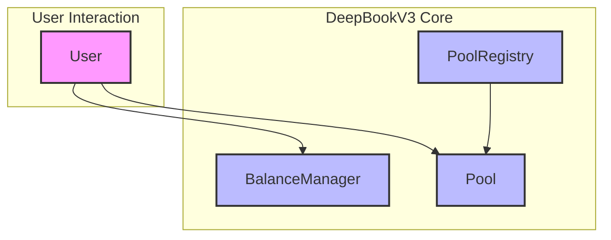

# DeepBookV3 Architectural Overview

DeepBookV3 is a decentralized Central Limit Order Book (CLOB) built on the Sui blockchain. It allows users to trade assets in a transparent and permissionless manner.

## Primary Shared Objects

The DeepBookV3 ecosystem revolves around three primary shared objects:

*   **`Pool`**: This is the central marketplace for a specific trading pair (e.g., SUI/USDC). Each `Pool` object manages its own order book, settles trades, and holds the liquidity for its respective pair. Users interact with a `Pool` to place limit orders, market orders, and cancel existing orders.
*   **`BalanceManager`**: This object represents a user's account within the DeepBookV3 system. It holds the user's funds (both base and quote assets for various pools) and is responsible for authorizing trading operations. Before a user can trade on a `Pool`, they must deposit funds into their `BalanceManager` and grant necessary approvals.
*   **`PoolRegistry`**: This object serves as a directory for all `Pool` instances. It manages the creation of new trading pools and lists them, making them discoverable by users and other applications.

## Core Pool Components and Processing Flow

Within each `Pool` object, there are several core components that manage the trading lifecycle:

*   **`Book`**: This component directly manages the order book, including adding new orders, matching existing orders, and removing orders.
*   **`State`**: This component holds the current state of the pool, such as trading fees, tick sizes, and other operational parameters.
*   **`Vault`**: These are secure containers holding the actual token balances for the pool (one for the base asset and one for the quote asset).

The typical processing flow for a trade within a `Pool` follows this sequence:

1.  **`Book`**: An incoming order is processed by the `Book`. If it's a taker order, it's matched against the existing resting orders. If it's a maker order, it's added to the book.
2.  **`State`**: The `State` component is updated to reflect changes resulting from the trade, such as accrued fees or updated pool statistics.
3.  **`Vault`**: Finally, the `Vault` components are updated to reflect the transfer of assets between the traders and the pool.

## High-Level Component Diagram

This diagram illustrates the basic relationships:
*   A **User** interacts with their **`BalanceManager`** to manage funds and with a **`Pool`** to execute trades.
*   A **`Pool`** is registered and discoverable through the **`PoolRegistry`**.
