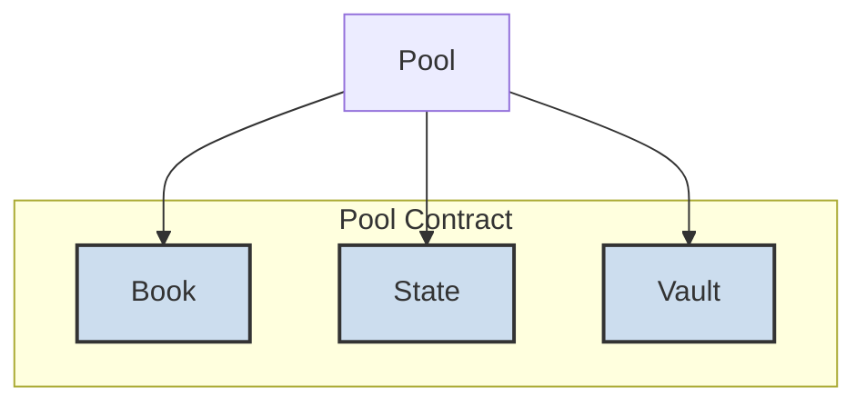
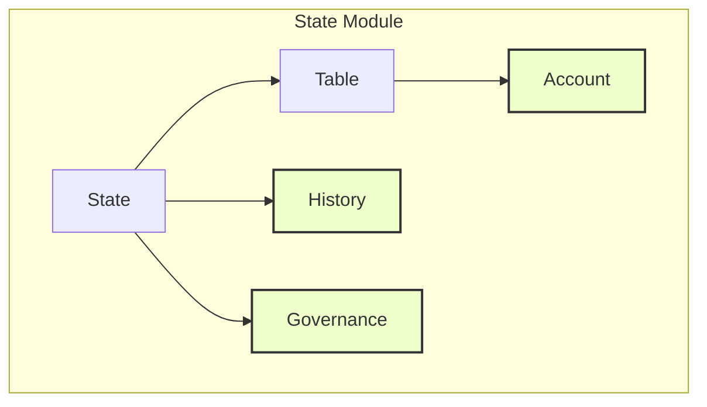
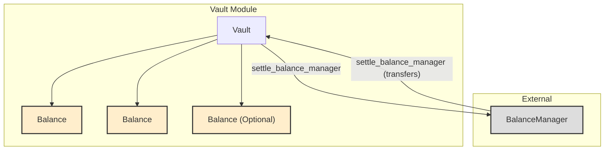
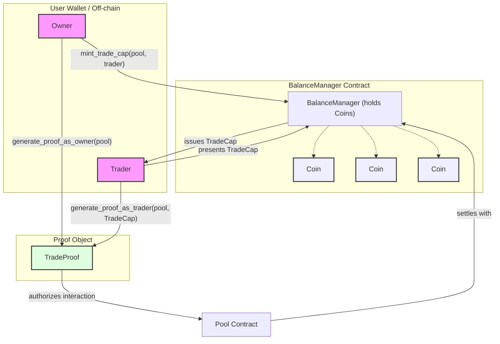
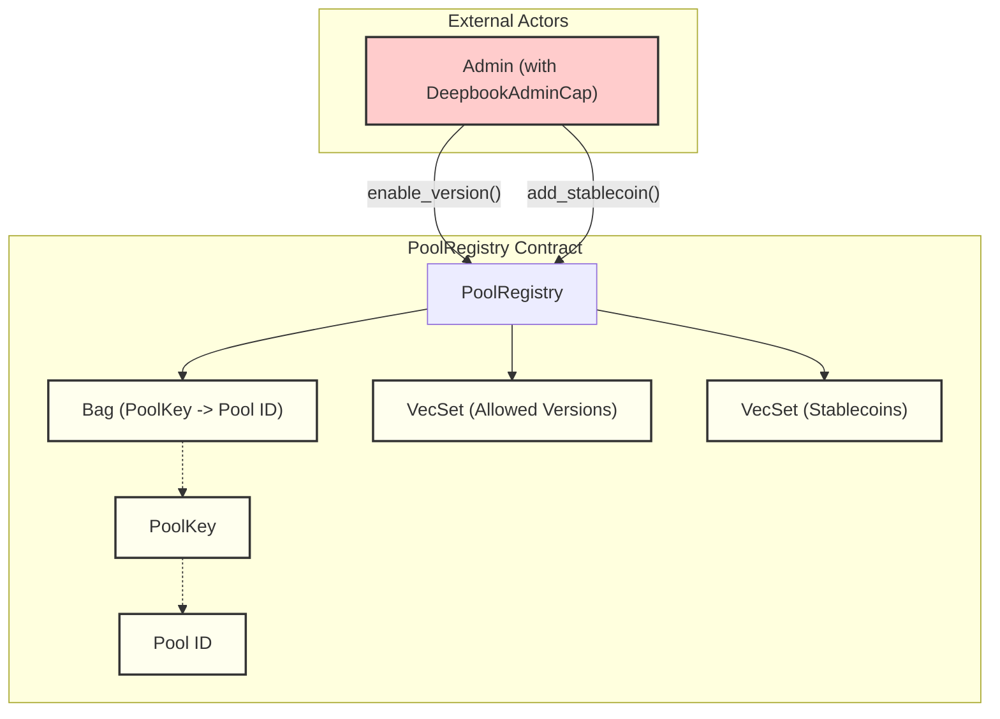

# DeepBookV3 Smart Contracts

This document provides an overview of the core smart contracts and modules within DeepBookV3.

## `Pool` (pool.move)

The `Pool` smart contract is the heart of DeepBookV3, acting as the central marketplace for a specific trading pair (e.g., SUI/USDC). It orchestrates all activities related to trading that pair.

**Main Responsibilities:**

*   **Order Placement:** Allows users to submit limit and market orders.
*   **Swaps:** Facilitates atomic swaps (market orders) against the current book state.
*   **Fund Settlement:** Manages the movement of funds resulting from matched trades, interacting with user `BalanceManager` accounts.
*   **Governance Interactions:** Handles interactions with the governance module, allowing for updates to pool parameters.
*   **Flash Loans:** Provides flash loan functionality for the underlying assets.

**Key Internal Components:**

The `Pool` contract encapsulates and coordinates three primary modules:

*   `Book`: Manages the order book.
*   `State`: Manages pool-specific state, user accounts, and history.
*   `Vault`: Holds and manages the actual token balances for the pool.



## `Book` Module (book/book.move)

The `Book` module is responsible for managing the order book for a given trading pair. It stores all resting limit orders (bids and asks) and contains the logic for matching incoming orders against the existing book.

**Purpose:** To maintain an ordered collection of buy (bid) and sell (ask) orders and execute trades by matching them.

**Core Data Structures:**

*   `bids: BigVector<Order>`: A sorted list of buy orders, typically ordered by price (highest to lowest) and then time.
*   `asks: BigVector<Order>`: A sorted list of sell orders, typically ordered by price (lowest to highest) and then time.
*   `Order`: A struct representing a single limit order, containing details like price, quantity, owner, etc.

**Key Functions/Logic:**

*   **Order Matching (`match_order`):** Core logic that takes an incoming order and iterates through the opposite side of the book to find matching orders.
*   **Fill Generation (`generate_fills`):** When orders are matched, this logic generates `Fill` events that detail the specifics of the trade (price, quantity, participants).
*   **Order Injection (`inject_order`):** Adds a new order to the appropriate side of the book (bids or asks) if it's not immediately matched. This includes maintaining the correct sort order.
*   **Order Cancellation:** Removes an existing order from the book.

**`create_order` Flowchart:**

```mermaid
graph TD
    A[Start: create_order] --> B{Validate Order (price, quantity, funds)};
    B -- Valid --> C{Is it a Taker Order? (crosses spread)};
    B -- Invalid --> X[Reject Order];
    C -- Yes --> D[Match Order against Book];
    D --> E{Any Fills Generated?};
    E -- Yes --> F[Generate Fill Events];
    E -- No --> G[Order Partially Filled or Unfilled];
    F --> G;
    C -- No (Maker Order) --> H[Inject Order into Book];
    G --> H;
    H --> Z[End];
```

## `State` Module (state/state.move)

The `State` module is responsible for managing all pool-related state that is not part of the active order book or the direct asset balances. This includes user account information within the pool, historical data, and governance parameters.

**Purpose:** To track user-specific data, pool history, and configurable pool parameters.

**Core Data Structures:**

*   `accounts: Table<ID, Account>`: A table mapping user IDs (or `BalanceManager` IDs) to their `Account` struct, which stores information like trading volume, fee tiers, and claimed rebates.
*   `History`: A struct (or set of structs) to store historical data such as trading volume over time, snapshots of pool liquidity, etc.
*   `Governance`: A struct (or set of structs) that holds pool-specific governance parameters, such as trading fees, tick size, minimum order size, and information about ongoing or past governance proposals.
*   `Account`: Struct containing user-specific information like `base_balance_locked`, `quote_balance_locked`, `volume`, `pending_rebates`.

**Key Functions/Logic:**

*   **Processing Fills:** Updates user accounts based on `Fill` events generated by the `Book` (e.g., updating trading volumes, calculating fees owed).
*   **User Volume Tracking:** Accumulates trading volume for users to determine fee tiers or eligibility for rewards.
*   **Fee Calculation:** Calculates trading fees based on the fill amount, user's fee tier, and current pool fee rates.
*   **Proposal/Vote Management:** Handles the creation, voting, and execution of governance proposals related to pool parameters.
*   **Rebate Handling:** Manages the distribution of trading fee rebates to eligible users (e.g., market makers or high-volume traders).

**`State` Component Relationships:**



## `Vault` Module (vault/vault.move)

The `Vault` module is responsible for holding the actual token balances for the trading pair within the `Pool`. It handles the secure storage of these assets and manages their movement during settlement with user `BalanceManager` accounts and for flash loans.

**Purpose:** To securely store the pool's assets and facilitate the transfer of these assets during trade settlement and flash loans.

**Core Data Structures:**

*   `base_asset_vault: Balance<BaseAsset>`: Holds the pool's balance of the base asset (e.g., SUI).
*   `quote_asset_vault: Balance<QuoteAsset>`: Holds the pool's balance of the quote asset (e.g., USDC).
*   `deep_rewards_vault: Balance<DEEP>`: (If applicable) Holds DEEP tokens for liquidity mining rewards or other incentives.
*   `Balance<T>`: Sui framework's generic type for holding tokens of type `T`.

**Key Functions/Logic:**

*   **`settle_balance_manager`:** This is a crucial function that interacts with a user's `BalanceManager`. After trades are matched and fills are generated, this function is called to transfer assets to/from the user's `BalanceManager` and the `Pool`'s vaults. For example, if a user buys SUI with USDC, their `BalanceManager` will receive SUI from the `base_asset_vault` and send USDC to the `quote_asset_vault`.
*   **Flash Loan Borrow (`flash_loan_borrow`):** Allows users to borrow assets from the vaults for a single transaction, provided they repay the loan plus a fee within the same transaction.
*   **Flash Loan Repay (`flash_loan_repay`):** Handles the repayment of flash loans.
*   **Deposit/Withdraw (Administrative):** Functions for initially seeding the pool with liquidity or for administrative actions (less common in typical user interaction).

**`Vault` Interactions:**



## `BalanceManager` (balance_manager.move)

The `BalanceManager` is a user-specific smart contract that acts as their personal account for interacting with DeepBookV3 pools. It holds their funds (various SUI Coins like SUI, USDC, etc.), manages different asset balances, and is crucial for authorizing trading operations. Authorization is handled through capabilities (`TradeCap`, `DepositCap`, `WithdrawCap`) and `TradeProof` objects.

**Purpose:** To provide a secure and flexible way for users to manage their funds and delegate trading permissions without giving direct control over their entire wallet.

**Core Data Structures:**

*   `balances: Bag`: A collection (bag) where keys are asset type names (e.g., `0x2::sui::SUI`) and values are `Coin` objects of that asset. This allows the `BalanceManager` to hold a variety of tokens.
*   `capabilities: Bag`: Stores granted capabilities. For example, a `TradeCap` for a specific trader address and pool ID would be stored here, allowing that trader to generate `TradeProof`s for that pool.
    *   `TradeCap`: Authorizes trading on specific pools.
    *   `DepositCap`: Authorizes depositing funds into the `BalanceManager`.
    *   `WithdrawCap`: Authorizes withdrawing funds from the `BalanceManager`.
*   `allowlist: VecSet<ID>`: (Potentially) A set of pool IDs or other entities that this `BalanceManager` is explicitly allowed to interact with, as a security measure.

**Key Public Functions/Logic:**

*   **`new(owner: address)`:** Creates a new `BalanceManager` instance, assigning the `owner`.
*   **`mint_trade_cap(ctx: &mut TxContext, pool_id: ID, trader: address)`:** Allows the `owner` to grant trading permission for a specific `pool_id` to a `trader` address.
*   **`mint_deposit_cap(ctx: &mut TxContext, depositor: address)`:** Allows the `owner` to grant deposit permission to a `depositor`.
*   **`mint_withdraw_cap(ctx: &mut TxContext, withdrawer: address)`:** Allows the `owner` to grant withdrawal permission to a `withdrawer`.
*   **`generate_proof_as_owner(ctx: &mut TxContext, pool_id: ID): TradeProof`:** Allows the `owner` to generate a `TradeProof` for themselves to trade on a given `pool_id`.
*   **`generate_proof_as_trader(self: &BalanceManager, pool_id: ID, trader_cap: TradeCap): TradeProof`:** Allows a `trader` (who possesses a valid `TradeCap`) to generate a `TradeProof` to trade on the specified `pool_id`. The `TradeProof` is a short-lived object that authorizes the `Pool` to interact with the `BalanceManager` for a specific transaction.
*   **`deposit(self: &mut BalanceManager, coin: Coin<T>, cap_or_ctx)`:** Deposits `Coin<T>` into the `BalanceManager`. Requires either a `DepositCap` or `TxContext` (if owner is depositing).
*   **`withdraw(self: &mut BalanceManager, amount: u64, cap_or_ctx): Coin<T>`:** Withdraws `Coin<T>` of the specified `amount`. Requires either a `WithdrawCap` or `TxContext` (if owner is withdrawing).

**`BalanceManager` Interaction Diagram:**



## `PoolRegistry` (registry.move)

The `PoolRegistry` is a singleton smart contract that serves as a directory for all `Pool` instances created within DeepBookV3. It ensures that trading pairs are unique, manages allowed package versions for creating pools, and maintains a whitelist of stablecoins that can be used as quote assets.

**Purpose:** To manage the creation, listing, and discoverability of trading pools, ensuring uniqueness and adherence to system-wide rules.

**Core Data Structures:**

*   `pools: Bag`: A collection where keys are `PoolKey` structs (containing type information for base and quote assets) and values are the `ID` of the corresponding `Pool` object. This prevents duplicate pools for the same asset pair.
*   `allowed_versions: VecSet<u64>`: A set of package version numbers (from the `Versioned` object of the `pool.move` package) that are currently permitted to create new pools. This allows for controlled upgrades and deprecation of older pool contract versions.
*   `stablecoin_whitelist: VecSet<TypeName>`: A set of `TypeName`s for tokens that are recognized as stablecoins and can be used as the quote currency in a new pool.
*   `DeepbookAdminCap`: An admin capability object required to call administrative functions on the registry.

**Key Public Functions/Logic:**

*   **`register_pool<BaseAsset, QuoteAsset>(ctx: &mut TxContext, version_witness: VersionWitness<Pool>, ...): ID`:** Creates and registers a new `Pool` for the given `BaseAsset` and `QuoteAsset` types.
    *   Checks if the `QuoteAsset` is in the `stablecoin_whitelist`.
    *   Checks if the `version_witness` corresponds to a version in `allowed_versions`.
    *   Ensures the pool (identified by `PoolKey{BaseAsset, QuoteAsset}`) doesn't already exist.
    *   Creates the new `Pool` object and stores its `ID` in the `pools` bag.
*   **`get_pool_id<BaseAsset, QuoteAsset>(): ID`:** Returns the `ID` of the pool for the given asset pair, if it exists.
*   **`get_all_pools(): vector<PoolInfo>`:** Returns a list of all registered pools with their key information.
*   **Admin Functions (require `DeepbookAdminCap`):**
    *   `enable_version(version: u64, cap: &DeepbookAdminCap)`: Adds a new package version to `allowed_versions`.
    *   `disable_version(version: u64, cap: &DeepbookAdminCap)`: Removes a package version from `allowed_versions`.
    *   `add_stablecoin<StableCoin>(cap: &DeepbookAdminCap)`: Adds a new stablecoin type to the `stablecoin_whitelist`.
    *   `remove_stablecoin<StableCoin>(cap: &DeepbookAdminCap)`: Removes a stablecoin type from the `stablecoin_whitelist`.

**`PoolRegistry` Structure and Admin Interaction:**



## Helper Modules

These modules provide common utilities and data structures used across the DeepBookV3 smart contracts.

### `big_vector.move` (helper/big_vector.move)

*   **Purpose:** Provides a scalable, vector-like data structure that is more gas-efficient for large collections than Sui's native `vector`. It is based on a B+ tree implementation. The `Book` module uses `big_vector` extensively to store buy and sell orders, allowing the order book to grow to a significant size without hitting prohibitive gas costs for common operations.
*   **Key Features:**
    *   Efficient insertion of elements while maintaining sort order.
    *   Efficient removal of elements.
    *   Efficient iteration over elements (forwards and backwards).
    *   Suitable for managing large, ordered datasets on-chain.

### `constants.move` (helper/constants.move)

*   **Purpose:** Defines a set of shared constants used throughout the DeepBookV3 package. This centralizes important values, making them easier to manage and update, and improves code readability.
*   **Key Examples:**
    *   `MAX_PRICE_LEVELS`: Maximum number of price levels in an order book.
    *   `FEE_PRECISION`: Scaling factor for fee calculations.
    *   `MIN_ORDER_QUANTITY`: Minimum quantity for an order.
    *   `ORDER_TYPE_LIMIT`, `ORDER_TYPE_MARKET`: Constants representing different order types.
    *   `ORDER_STATUS_OPEN`, `ORDER_STATUS_FILLED`, `ORDER_STATUS_CANCELLED`: Constants for order statuses.
    *   Error codes used across modules.

### `math.move` (helper/math.move)

*   **Purpose:** Provides mathematical utility functions, particularly for fixed-point arithmetic, which is essential for financial calculations on-chain where floating-point numbers are not natively supported or can lead to non-determinism.
*   **Key Functions:**
    *   `mul(u64, u64, u64): u64`: Fixed-point multiplication with a scaling factor.
    *   `div(u64, u64, u64): u64`: Fixed-point division with a scaling factor, often with options for rounding (e.g., `div_ceil`, `div_floor`).
    *   `sqrt(u64): u64`: Calculates the integer square root.
    *   `median(vector<u64>): u64`: Calculates the median of a list of numbers.
    *   Functions for safe addition and subtraction to prevent overflows/underflows.

### `utils.move` (helper/utils.move)

*   **Purpose:** Provides a collection of miscellaneous utility functions that don't fit neatly into other specific helper modules but are used in various parts of the DeepBookV3 codebase.
*   **Key Functions/Highlights:**
    *   **`encode_order_id(price: u64, timestamp: u64, sequence_number: u64): u128`**: Encodes price, time, and a sequence number into a single `u128` value. This is critical for the order book's sorting mechanism, ensuring price-time priority. Earlier timestamps at the same price level get higher priority.
    *   **`decode_order_id(order_id: u128): (u64, u64, u64)`**: Decodes a `u128` order ID back into its constituent price, timestamp, and sequence number.
    *   Other utilities might include type conversions, assertion helpers, or small common operations.

## `order_query.move`

*   **Purpose:** This module provides functions for querying and iterating over orders within a `Pool`, primarily designed for off-chain clients or UI consumption. It allows for paginated fetching of order book data without requiring direct, potentially complex, interaction with the `Book` module's internal `big_vector` structures.
*   **Core Data Structures:**
    *   `OrderPage`: A struct used to return a paginated list of orders. It typically contains:
        *   `orders: vector<OrderInfo>`: A vector of `OrderInfo` structs (simplified representation of an order for external consumers).
        *   `next_cursor: Option<Cursor>`: A cursor to fetch the next page of results, or `None` if it's the last page.
*   **Key Functions/Logic:**
    *   **`iter_orders<BaseAsset, QuoteAsset>(pool: &Pool, side: u8, start_cursor: Option<Cursor>, limit: u64): OrderPage`**:
        *   Takes a reference to the `Pool`, the `side` of the book to query (bid or ask), an optional `start_cursor` to resume iteration, and a `limit` for the number of orders per page.
        *   Iterates through the specified side of the order book (managed by the `Book` module) starting from the `start_cursor`.
        *   Collects `limit` orders into an `OrderPage` and provides a `next_cursor` for the next iteration.
    *   Functions to get specific order details by ID might also be present.
