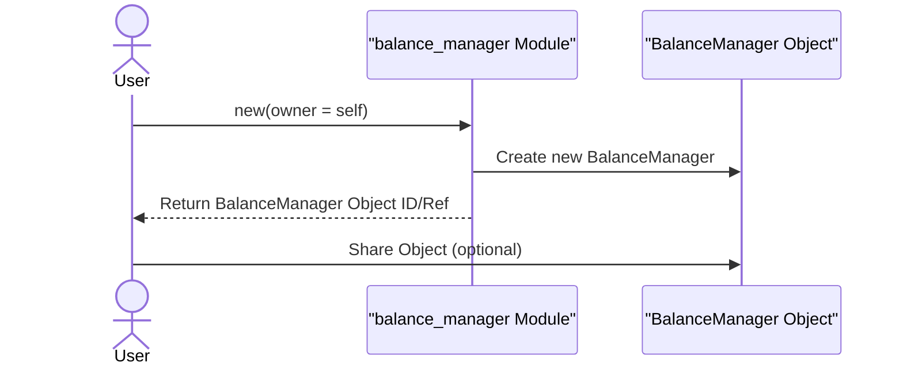
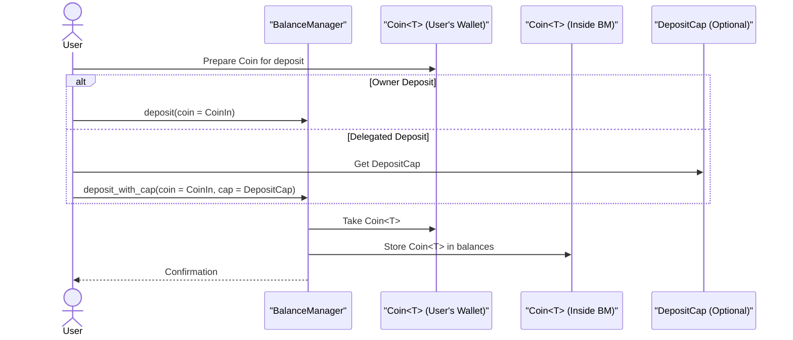
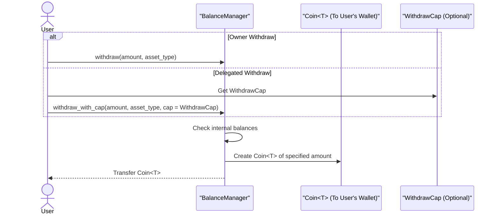
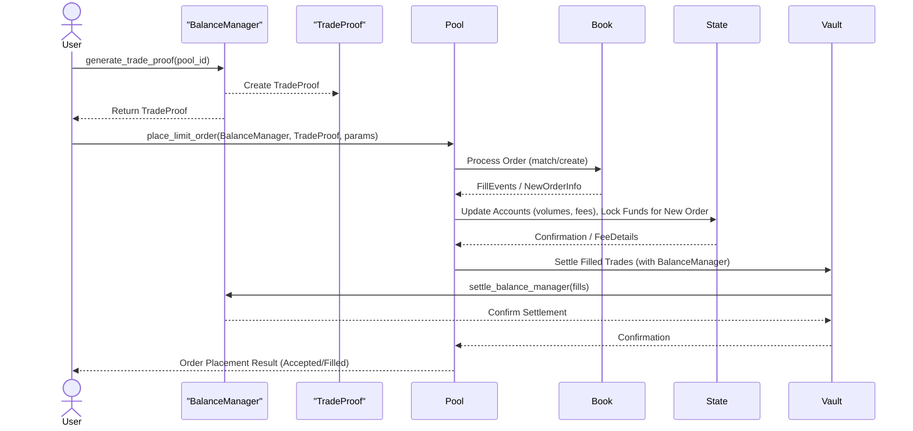
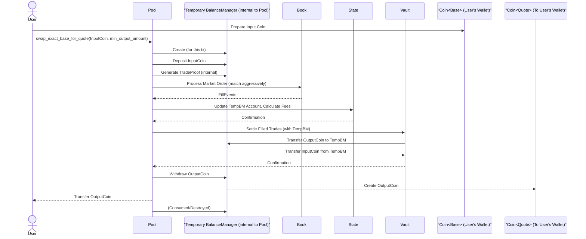
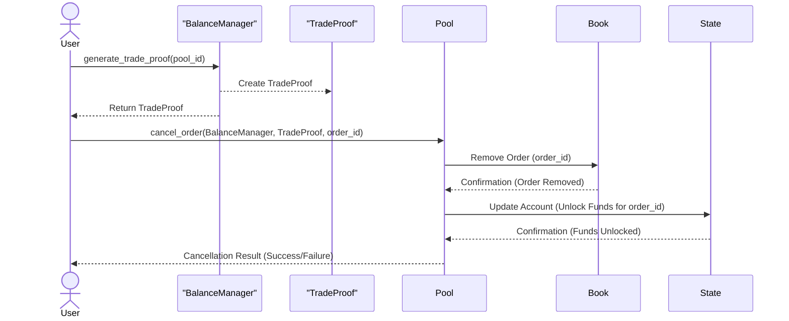
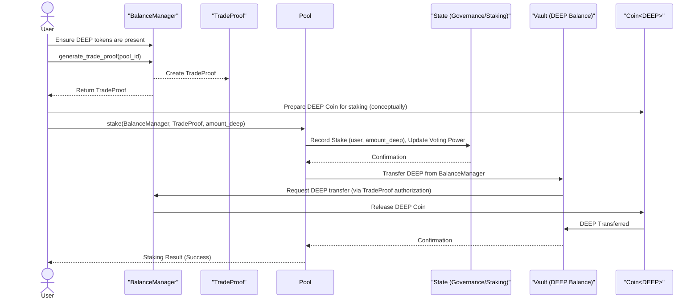
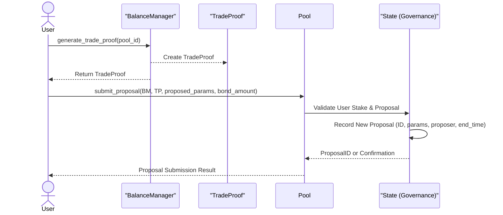
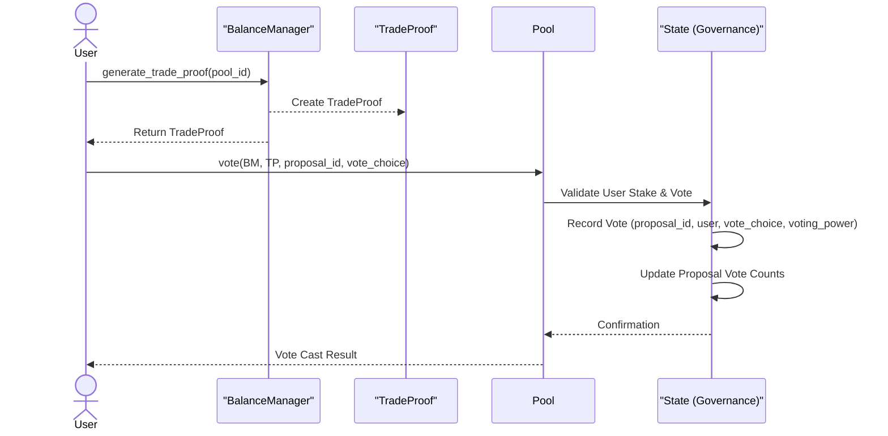
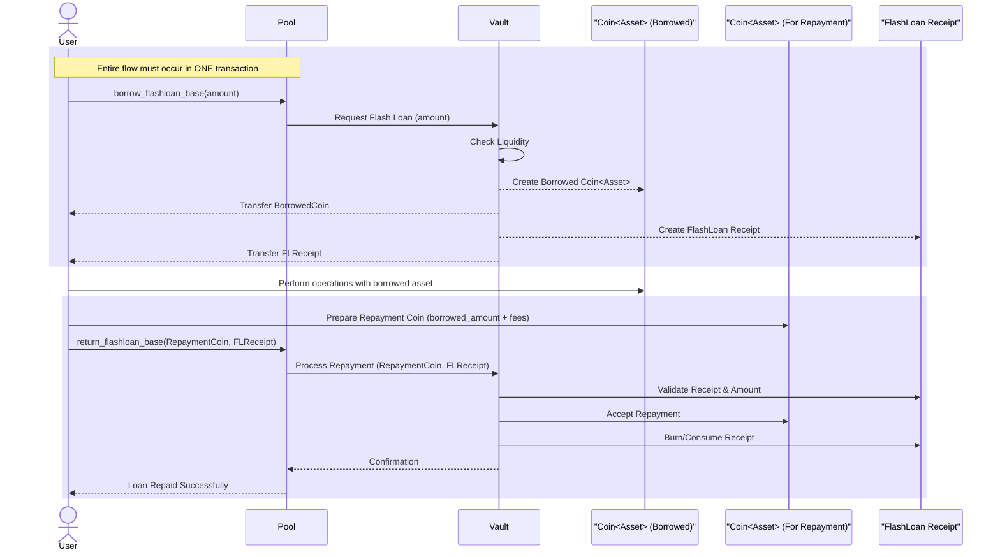

# DeepBookV3 User Flows

This document outlines common user interaction flows within the DeepBookV3 system.

## 1. Creating a BalanceManager

A `BalanceManager` is a user's personal account for holding funds and authorizing trades on DeepBookV3 pools.

**Steps:**

1.  The user initiates a transaction calling the `balance_manager::new` (or `new_with_owner`) function.
2.  This function creates a new `BalanceManager` object.
3.  The `BalanceManager` object ID is returned to the user, and the object is typically shared so it can be used in further interactions.

**Sequence Diagram:**

## 2. Depositing Funds to BalanceManager

Users deposit assets (Coins) into their `BalanceManager` to make them available for trading.

**Steps:**

1.  The user (either the owner of the `BalanceManager` or an address holding a `DepositCap` for it) prepares the `Coin` object they wish to deposit.
2.  The user calls the `balance_manager::deposit` function (or `deposit_with_cap` if using a capability).
3.  The `BalanceManager` receives the `Coin` and adds it to its internal `balances` Bag, keyed by the coin's type.

**Sequence Diagram:**

## 3. Withdrawing Funds from BalanceManager

Users can withdraw their assets from the `BalanceManager` back to their wallet.

**Steps:**

1.  The user (either the owner of the `BalanceManager` or an address holding a `WithdrawCap`) decides on the asset type and amount to withdraw.
2.  The user calls the `balance_manager::withdraw` function (or `withdraw_with_cap` if using a capability), specifying the amount and asset type.
3.  The `BalanceManager` checks its internal `balances`, creates a new `Coin` object of the specified amount and type, and transfers it to the user.

**Sequence Diagram:**

## 4. Placing a Limit Order

Placing a limit order involves interaction with both the `BalanceManager` (for authorization and funds) and the target `Pool` (for order execution).

**High-Level Steps:**

1.  **Generate `TradeProof`**: The user (either the owner of the `BalanceManager` or an entity holding a valid `TradeCap` for the specific pool) calls the appropriate function on their `BalanceManager` (e.g., `generate_proof_as_owner` or `generate_proof_as_trader`) to obtain a `TradeProof` object. This `TradeProof` is a short-lived authorization for the `Pool` to interact with the `BalanceManager`.
2.  **Call `place_limit_order`**: The user constructs a transaction calling the `pool::place_limit_order` function. This call includes references to the `Pool`, the user's `BalanceManager`, the generated `TradeProof`, and order parameters (e.g., price, quantity, side).

**Internal "Book -> State -> Vault" Flow within the Pool:**

*   **`Book` Interaction**:
    *   The `Pool` first passes the order details to its `Book` module.
    *   The `Book` attempts to match the incoming limit order against existing resting orders on the opposite side of the book.
    *   If matches occur (taker behavior), `Fill` events are generated.
    *   If the order is not fully filled, or not matched at all (maker behavior), the remaining quantity is injected as a new resting order into the `Book`'s `BigVector` for bids or asks.
*   **`State` Interaction**:
    *   The `Pool` then interacts with its `State` module.
    *   If `Fill` events were generated, the `State` module updates the involved users' account information (e.g., trading volume, pending rebates).
    *   It calculates any applicable trading fees based on the fills and the pool's fee structure.
    *   It locks the necessary funds (base or quote currency) in the user's `Account` within the `State` module for any new resting order created.
*   **`Vault` Interaction**:
    *   Finally, the `Pool` interacts with its `Vault` module(s) and the user's `BalanceManager`.
    *   For matched portions of the order (fills), the `Vault` facilitates the settlement of funds. It calls `settle_balance_manager` on the user's `BalanceManager` (and the counterparty's, though this is often abstracted) to transfer assets. For example, if the user bought SUI with USDC, the `Pool`'s SUI vault decreases, its USDC vault increases, and the `BalanceManager` will see its SUI balance increase and USDC balance decrease (or quote assets locked by the `State` module are now spent).
    *   For new resting orders, the `Vault` ensures the corresponding amount of the offered asset is effectively "held" or accounted for, by coordinating with the `State` module's record of locked balances in the user's `Account`.

**Sequence Diagram:**

## 5. Placing a Market Order (Swap)

A swap is essentially a market order that consumes liquidity from the book up to a certain price or amount. DeepBookV3 provides functions like `swap_exact_base_for_quote` or `swap_exact_quote_for_base` for this. These functions are designed for convenience and often handle `BalanceManager` interactions internally.

**Steps:**

1.  The user prepares the input `Coin` object(s) they wish to swap (e.g., `Coin<BaseAsset>`) and potentially a `Coin<DEEP>` for protocol fees if applicable.
2.  The user calls a swap function on the `Pool` (e.g., `pool::swap_exact_base_for_quote`), providing the input coin(s), and specifying the minimum amount of the output asset they are willing to receive (slippage control).
3.  **Internal Handling by the Pool:**
    *   The `Pool` function typically creates a temporary, single-transaction `BalanceManager` for the user.
    *   It deposits the user's provided input `Coin`(s) into this temporary `BalanceManager`.
    *   It generates a `TradeProof` from this temporary `BalanceManager`.
    *   It then internally places a market order (which can be thought of as a limit order with a price that ensures immediate execution against the book, or an order that iterates through available liquidity). This involves the standard "Book -> State -> Vault" flow:
        *   **`Book`**: The market order is matched against resting orders in the book, generating `Fill` events.
        *   **`State`**: User accounts (within the temporary `BalanceManager` context) are updated, and fees are calculated.
        *   **`Vault`**: Funds are settled. The temporary `BalanceManager`'s input coins are transferred to the `Pool`'s vaults, and the output coins (resulting from the swap) are transferred from the `Pool`'s vaults to the temporary `BalanceManager`.
    *   Finally, the `Pool` function automatically withdraws the resulting output assets (e.g., `Coin<QuoteAsset>`) and any unused input assets (e.g., remaining DEEP for fees) from the temporary `BalanceManager` and transfers them to the user.
    *   The temporary `BalanceManager` is consumed/destroyed within the transaction.

**Sequence Diagram:**

## 6. Canceling an Order

Users can cancel their resting limit orders if they haven't been fully matched.

**Steps:**

1.  The user (owner of the `BalanceManager` that placed the order, or an entity holding a `TradeCap` for it) identifies the `order_id` of the order they wish to cancel.
2.  The user generates a `TradeProof` from their `BalanceManager`.
3.  The user calls `pool::cancel_order`, providing references to the `Pool`, their `BalanceManager`, the `TradeProof`, and the `order_id`.

**Internal Flow:**

*   **`Book`**: The `Pool` instructs the `Book` module to remove the specified `order_id` from its bids or asks `BigVector`.
*   **`State`**: The `Pool` then informs the `State` module. The `State` module updates the user's `Account` to reflect that the funds previously locked for this order are now available (e.g., decreases `base_balance_locked` or `quote_balance_locked`).
*   **`Vault` / `BalanceManager`**: While direct fund movement might not always occur if the funds were only "locked" notionally in the `State`, the `BalanceManager` is now authorized to use these unlocked funds for new orders or withdrawals. If the `Pool`'s design involves actual transfers to "escrow" within the `Pool`'s `Vaults` for resting orders, then this step would also involve the `Vault` settling by transferring the unlocked assets back to the user's `BalanceManager`. (The diagram assumes a conceptual unlock managed by `State` and `BalanceManager`.)

**Sequence Diagram:**

## 7. Staking DEEP Tokens

Users can stake DEEP tokens in a `Pool` to participate in governance and potentially earn rewards.

**Steps:**

1.  The user ensures they have DEEP tokens in their `BalanceManager`.
2.  The user generates a `TradeProof` from their `BalanceManager`.
3.  The user calls `pool::stake` (or a similar function related to staking/governance), providing the `Pool` reference, their `BalanceManager`, the `TradeProof`, and the amount of DEEP tokens they wish to stake.

**Internal Flow:**

*   **`State`**: The `Pool` interacts with its `State` module (specifically, its governance or staking component). The `State` module records the amount of DEEP staked by the user, updating their voting power and potentially their eligibility for staking rewards.
*   **`Vault`**: The `Pool` instructs the `Vault` to handle the transfer of DEEP tokens. The DEEP tokens are moved from the user's `BalanceManager` into a designated DEEP balance within the `Pool`'s `Vault` (this could be the general DEEP rewards vault or a specific staking vault).

**Sequence Diagram:**

## 8. Participating in Governance

Governance allows staked DEEP token holders to propose changes to pool parameters (like fees) and vote on these proposals.

### a. Proposing a Change

**Steps:**

1.  The user (who has a sufficient amount of DEEP tokens actively staked) decides on the new parameters they want to propose (e.g., new trading fee, new stake requirement for proposals).
2.  The user generates a `TradeProof` from their `BalanceManager`.
3.  The user calls `pool::submit_proposal` (or similar), providing the `Pool`, `BalanceManager`, `TradeProof`, the proposed parameters, and potentially a bond or a portion of their stake to initiate the proposal.

**Internal Flow:**

*   **`State (Governance)`**: The `Pool` passes the proposal to its `State` module's governance component.
    *   The `State` module validates that the user has enough active stake to make a proposal.
    *   It records the new proposal with its details (proposed changes, proposer, submission time, voting period, current stake requirement).
    *   It might update the user's account state (e.g., to indicate they have an active proposal or to lock the proposal bond).

**Sequence Diagram (Proposing):**

### b. Voting on a Proposal

**Steps:**

1.  The user (who has DEEP tokens actively staked) identifies an active `proposal_id` they wish to vote on.
2.  The user generates a `TradeProof` from their `BalanceManager`.
3.  The user calls `pool::vote` (or similar), providing the `Pool`, `BalanceManager`, `TradeProof`, the `proposal_id`, and their vote (e.g., yes/no/abstain).

**Internal Flow:**

*   **`State (Governance)`**: The `Pool` passes the vote to its `State` module's governance component.
    *   The `State` module verifies the user's active stake and eligibility to vote on the specific proposal.
    *   It records the user's vote (and their voting power at the time of voting) for that `proposal_id`.
    *   It updates the overall vote counts (yes/no votes, total voting power cast) for the proposal.

**Sequence Diagram (Voting):**

## 9. Utilizing a Flash Loan

Flash loans allow users to borrow assets from a `Pool` for use within a single transaction, provided they repay the loan plus any associated fees by the end of that same transaction.

**Steps:**

1.  **Borrow Request**: The user calls a function like `pool::borrow_flashloan_base` or `pool::borrow_flashloan_quote` on the target `Pool`, specifying the `amount` of the asset they wish to borrow.
2.  **Asset Transfer & Receipt**:
    *   The `Pool`, through its `Vault` module, checks if it has sufficient liquidity.
    *   If available, the `Vault` transfers the requested `Coin<Asset>` to the user.
    *   The `Vault` also creates and transfers a `FlashLoan` receipt object to the user. This receipt is a capability-like object that proves the user has an active flash loan and is required for repayment.
3.  **User Operations**: The user performs arbitrary operations with the borrowed `Coin<Asset>` within the *same transaction*. This could involve arbitrage with another pool, liquidations, or any other on-chain activity.
4.  **Repayment**:
    *   Before the transaction concludes, the user *must* call the corresponding repayment function, e.g., `pool::return_flashloan_base` or `pool::return_flashloan_quote`.
    *   The user provides the repayment `Coin<Asset>` (which must be the original borrowed amount plus any accrued flash loan fees, though fee mechanisms can vary) and the `FlashLoan` receipt object they received.
5.  **Verification & Receipt Consumption**:
    *   The `Pool`'s `Vault` module verifies that the correct type and amount of the asset (original + fees) are being returned, using the information often stored or linked within the `FlashLoan` receipt.
    *   If the repayment is valid, the `Vault` accepts the `Coin<Asset>` and consumes/burns the `FlashLoan` receipt object.
    *   If the repayment is invalid (e.g., insufficient amount, wrong asset type, or if the repayment function is not called), the entire transaction will typically fail, ensuring the atomicity and risk-free nature (for the pool) of the flash loan.

**Sequence Diagram:**

